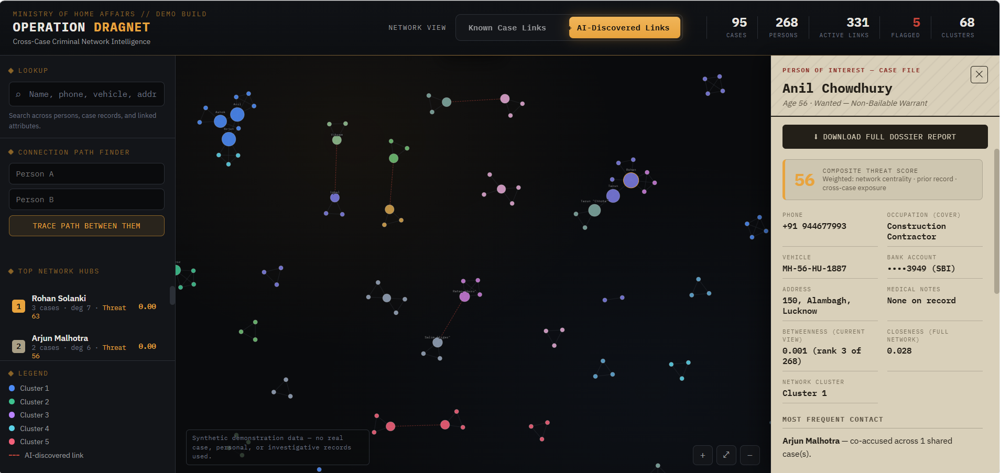
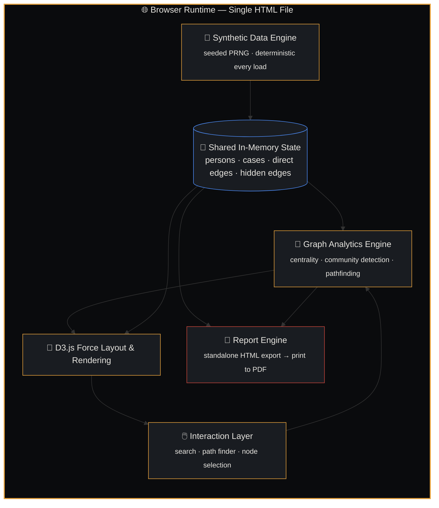

<div align="center">

# 🕸️ OPERATION DRAGNET

### Cross-Case Criminal Network Intelligence 

**A graph-intelligence platform that finds the connections your case files don't know they have.**

[](https://d3js.org/)
[](https://developer.mozilla.org/en-US/docs/Web/JavaScript)
[](#-getting-started)
[](LICENSE)
[](#️-a-note-on-data-and-responsible-use)

<br>

**[🎮 Live Demo](#) · [📖 Documentation](#-table-of-contents) · [🐛 Report a Bug](../../issues) · [💡 Request a Feature](../../issues)**

<br>

   

</div>

<br>

> **Most crime-record systems answer "what do we know about this person."**
> **Operation Dragnet answers "what does the *shape* of the data reveal that no single record shows on its own."**

<br>

<div align="center">



</div>

<br>

---

## 📚 Table of Contents

- [The Problem](#-the-problem)
- [What This Actually Does](#-what-this-actually-does)
- [Feature Highlights](#-feature-highlights)
- [See It In Action](#-see-it-in-action)
- [Architecture](#️-architecture)
- [The Algorithms](#-the-algorithms)
- [Getting Started](#-getting-started)
- [Project Structure](#-project-structure)
- [Tech Stack](#-tech-stack)
- [Roadmap](#️-roadmap)
- [A Note on Data & Responsible Use](#️-a-note-on-data-and-responsible-use)
- [Contributing](#-contributing)
- [License](#-license)
- [Acknowledgments](#-acknowledgments)

---

## 🧩 The Problem

Indian law enforcement already has systems like **CCTNS** that answer questions like *"show me this person's record"* or *"pull up this FIR."* These are **lookup systems** — fast, reliable, and structurally incapable of answering a different, harder class of question:

> *A phone number surfaces in a narcotics case in Delhi. The same number, under a different name, surfaces in an extortion case in Mumbai four months later. No officer in either city has any reason to compare the two files. That connection sits invisible in the data — until someone manually cross-references thousands of records by hand.*

That's the actual job of a link-analysis investigator today: a whiteboard, red string, and weeks of manual cross-referencing. **Operation Dragnet automates the whiteboard.**

## 🎯 What This Actually Does

Operation Dragnet ingests case records the same way any records system would, but instead of stopping at lookup, it builds a **graph** — people as nodes, shared case involvement and shared attributes as edges — and runs real, textbook graph algorithms over it to surface structure no single case file could ever show:

- **Who bridges two otherwise-unconnected criminal cells** (betweenness centrality)
- **Which individuals form a tightly-knit operational core** (community detection)
- **Which shared phone number, bank account, or vehicle plate quietly links two "unrelated" investigations** (cross-case attribute discovery)
- **What happens to the network if a specific person is arrested** (network resilience analysis)

Every single one of these is presented with **full, inspectable reasoning** — never a black-box score. If the system flags a connection, you can see exactly which shared attribute, which two case files, and how confident that inference actually is.

<br>

<div align="center">

### The entire product lives in one interaction:

| 🔍 Known Case Links | ⚡ + AI-Discovered Links |
|:---:|:---:|
| Exactly what any existing records system already shows you | The same network, with cross-case attribute links revealed |
| Isolated clusters, no visible relationship | Clusters visibly connect — the "aha" moment, live |

**Toggle between them, and watch the network re-form in real time.**

</div>

---

## ✨ Feature Highlights

🕸️ **Interactive Force-Directed Network Graph**
268 individuals, 95 case records, rendered as a fully interactive, zoomable, draggable D3.js network — not a static diagram.

🔦 **Live Cross-Case Link Discovery**
Five deliberately traceable scenarios where a shared bank account, phone number, vehicle plate, or address connects two cases that share no other visible link — each with a plain-English explanation and a confidence tier (high / medium / low).

🧭 **Connection Path Finder**
Pick *any two* of the 268 people and get the actual shortest connecting path, computed live via graph traversal — not a pre-scripted reveal. Try it on people you didn't plan to click.

🎯 **Composite Threat Score**
A transparent, weighted 0–100 score blending betweenness, closeness, and degree centrality with prior-record depth and cross-case exposure — every input inspectable, nothing hidden behind a black box.

📇 **Full Investigative Dossiers**
Click anyone to see their complete profile — contact details, family, prior record, most-frequent contact (derived from real edge weights, not flavor text), frequently visited locations, and their exact position in the network.

📄 **One-Click 4-Page Intelligence Reports**
Every dossier can generate a complete, print-ready report: profile, criminal history, direct connections, a ranked **"Prime Suspects in Extended Network"** table with fully traced connection paths, and a templated investigator assessment.

🔬 **Real Graph Theory, Not Decoration**
Brandes' betweenness centrality, Wasserman-Faust closeness centrality, label-propagation community detection — implemented from the actual algorithms, not approximated with heuristics dressed up to look sophisticated.

⚡ **Zero Backend, Zero Setup**
One static HTML file. No server, no database, no build step, no API keys. Open it in a browser and it works — offline, indefinitely, on any machine.

---

## 🖥️ See It In Action

<div align="center">
<table>
<tr>
<td width="50%" align="center"><br><sub>The main network view — hover any node to reveal its label and connections</sub></td>
<td width="50%" align="center"><br><sub>A full investigative dossier, and the generated 4-page report</sub></td>
</tr>
</table>
</div>

---

## 🏗️ Architecture



**Why single-file, client-side only?** A live demonstration has exactly one hard requirement: it must not fail due to network conditions or backend cold-starts at the exact moment it matters. A static HTML file has no such failure mode — and at this system's scale (hundreds of nodes), every algorithm below runs in single-digit milliseconds in-browser.

---

## 🧠 The Algorithms

Every metric this system reports is backed by a real, named, textbook graph algorithm — not a heuristic dressed up to sound sophisticated.

| Algorithm | Answers | Complexity | Status |
|---|---|:---:|:---:|
| **Degree Centrality** | How many direct connections does this person have? | `O(V + E)` | ✅ |
| **Betweenness Centrality** (Brandes') | Who bridges two otherwise-separate clusters? | `O(V·E)` | ✅ |
| **Closeness Centrality** (Wasserman-Faust corrected) | Who can reach the rest of the network fastest? | `O(V·(V+E))` | ✅ |
| **Label Propagation** | Which individuals form a natural community? | `O(iter × (V+E))` | ✅ |
| **Composite Threat Score** | Given everything, how should attention be prioritized? | `O(V·E)` | ✅ |
| **BFS Shortest Path** | How are any two people connected? | `O(V + E)` | ✅ |
| Louvain Modularity Optimization | A quality upgrade to community detection, with a defensible Q-score | `O(V log V)` | 🔜 |
| PageRank | Who's connected to *other* important people? | `O(iter × E)` | 🔜 |
| K-Core Decomposition | Which subgroup is a maximally dense operational cell? | `O(V + E)` | 🔜 |
| Articulation Points (Tarjan's) | If we remove this person, does the network fragment? | `O(V + E)` | 🔜 |
| Link Prediction (Adamic-Adar) | Who's *probably* connected, but not yet confirmed? | `O(V²)` naive | 🔜 |
| Weighted Dijkstra Pathfinding | The strongest-evidence path, not just the shortest | `O((V+E) log V)` | 🔜 |
| Fuzzy Entity Resolution | Catching name variants and aliases across records | `O(V²/blocks)` | 🔜 |

<sub>✅ implemented in the current build · 🔜 fully specified with pseudocode in the project's [Master Prompt](Operation_Dragnet_Master_Prompt.md), ready to build</sub>

> 📘 **Want the full mathematical specification?** Every algorithm above — plus 5 more advanced ones — is documented with complete pseudocode, complexity analysis, and design rationale in [`Operation_Dragnet_Master_Prompt.md`](Operation_Dragnet_Master_Prompt.md), a 14,000-word technical specification suitable for handing straight to an engineer or an AI coding agent.

---

## 🚀 Getting Started

No installation. No dependencies to manage. That's the point.

```bash
# Clone the repo
git clone https://github.com/your-username/operation-dragnet.git
cd operation-dragnet

# Open it. That's the entire setup process.
open operation-dragnet.html      # macOS
start operation-dragnet.html     # Windows
xdg-open operation-dragnet.html  # Linux
```

Or skip the clone entirely — download the single HTML file and double-click it. It runs from `file://`, no server required.

<details>
<summary><b>🖱️ Quick tour once it's open</b></summary>
<br>

1. **Toggle the view** at the top — flip between `Known Case Links` and `+ AI-Discovered Links` and watch the network re-form.
2. **Click any node** to open their full dossier.
3. **Try the Path Finder** in the left sidebar — pick any two names and trace how they're connected.
4. **Click a flagged link** in the right panel to see the system trace *why* it thinks two unrelated cases are connected.
5. **Download a report** from any dossier for the full 4-page investigative writeup.

</details>

---

## 📁 Project Structure

```
operation-dragnet/
├── operation-dragnet.html              # The entire application — single file
├── README.md                           # You are here
└── LICENSE
```

---

## 🛠️ Tech Stack

<div align="center">


</div>

- **[D3.js v7](https://d3js.org/)** — force-directed graph layout, zoom/pan/drag, data-join rendering
- **Vanilla JavaScript (ES6+)** — no framework, no build step, by design
- **IBM Plex Mono + IBM Plex Sans** — typography
- **Seeded PRNG (mulberry32)** — deterministic synthetic data, identical on every load
- **Zero backend** — every algorithm runs client-side

---

## 🗺️ Roadmap

- [x] Core force-directed network visualization
- [x] Known vs. AI-Discovered link toggle
- [x] Brandes' betweenness + Wasserman-Faust closeness centrality
- [x] Label propagation community detection
- [x] Composite Threat Score
- [x] Connection Path Finder (BFS)
- [x] 4-page downloadable dossier reports
- [ ] Network Resilience panel (articulation points — *highest priority next build*)
- [ ] Louvain modularity optimization
- [ ] PageRank as a secondary ranking signal
- [ ] Weighted, confidence-aware pathfinding (Dijkstra)
- [ ] Predictive link suggestions (Adamic-Adar)
- [ ] Temporal network evolution timeline
- [ ] Fuzzy entity resolution across name variants

> Full specification for every unchecked item — pseudocode included — lives in [`Operation_Dragnet_Master_Prompt.md`](Operation_Dragnet_Master_Prompt.md).

---

## ⚠️ A Note on Data and Responsible Use

> **This project uses 100% synthetic, seeded demonstration data.** No real case records, personal data, or investigative material of any kind was used in building or demonstrating this system. Every name, case, and connection is fabricated for the purpose of illustrating the underlying graph-analysis techniques.

This matters beyond a legal disclaimer. A few things worth reading before you fork this:

- **Every flagged connection carries a confidence tier** (high / medium / low) and is presented with full reasoning — never as a bare accusation. A shared address is a lead worth verification, not evidence of guilt, and that distinction is load-bearing throughout the design.
- **The Threat Score is a prioritization aid, not a determination.** This system does not, and should not be extended to, recommend or take enforcement action. It exists to surface non-obvious structure for a human investigator's judgment — nothing more.
- **A real deployment would need real safeguards** this hackathon demo doesn't have: legal authorization, audit logging, data-retention policy, and independent fairness review — especially for anything resembling predictive scoring. See the Ethics section of the [Master Prompt](Operation_Dragnet_Master_Prompt.md) for the full discussion.

If you're extending this for a hackathon or research context: keep the synthetic-data disclosure visible everywhere the system is shown, and don't let a demo's polish outrun its honesty about what it actually is.

---

## 🤝 Contributing

Contributions, issues, and feature requests are welcome — especially implementations of any 🔜 algorithm from the table above.

1. Fork the repo
2. Create your feature branch (`git checkout -b feature/louvain-modularity`)
3. Commit your changes (`git commit -m 'Add Louvain modularity optimization'`)
4. Push to the branch (`git push origin feature/louvain-modularity`)
5. Open a Pull Request

If you're picking up an algorithm from the roadmap, the [Master Prompt](Operation_Dragnet_Master_Prompt.md) has full pseudocode and complexity analysis for every one of them — no need to reinvent it from a research paper.

---

## 📄 License

Distributed under the MIT License. See [`LICENSE`](LICENSE) for details.

---

## 🙏 Acknowledgments

- Graph algorithms implemented from their original sources: Brandes (2001) for betweenness centrality, Wasserman & Faust (1994) for corrected closeness centrality
- Typography: [IBM Plex](https://www.ibm.com/plex/)
- Visualization: [D3.js](https://d3js.org/)

<br>

<div align="center">

**If this project helped you understand graph-based intelligence analysis, consider giving it a ⭐**

<sub>Built with a genuine respect for the difference between "looks impressive" and "is actually true." Both, ideally, at once.</sub>

</div>
